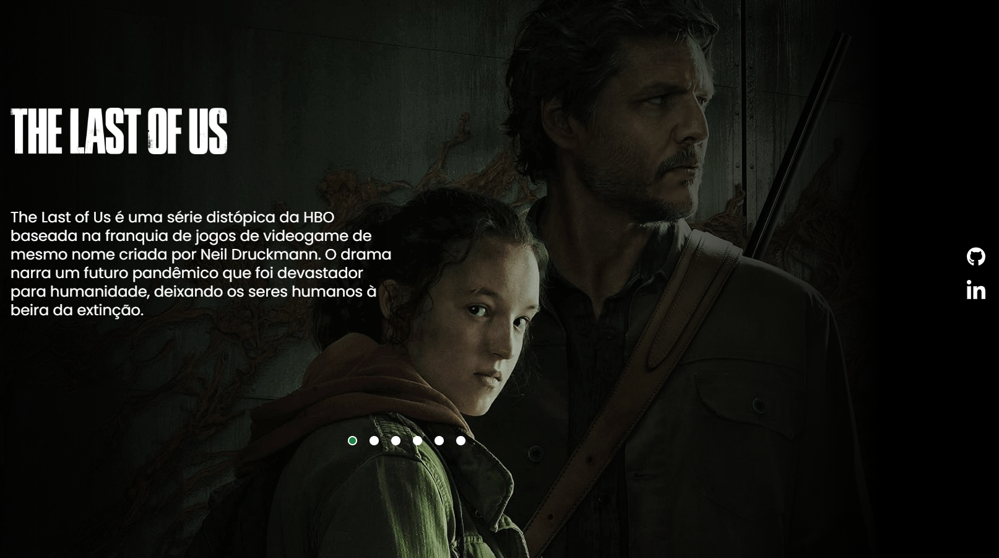

# The Last of us project

This is a project to the [The Last of us project page](https://rafaelsanm.github.io/projeto-the-last-of-us/). Frontend Mentor challenges help you improve your coding skills by building realistic projects. 

As most of my work, this solution is being constantly updated as I learn new things and find better solutions for my problems, so please, take this into consideration!

## Table of contents

- [Overview](#overview)
  - [The challenge](#the-challenge)
  - [Screenshot](#screenshot)
- [My process](#my-process)
  - [Built with](#built-with)

## Overview

### The challenge

Users should be able to:

- See hover states for interactive elements

### Screenshots

## My process

### Built with

- Semantic HTML5 markup
- CSS custom properties
- Flexbox
- JavaScript

